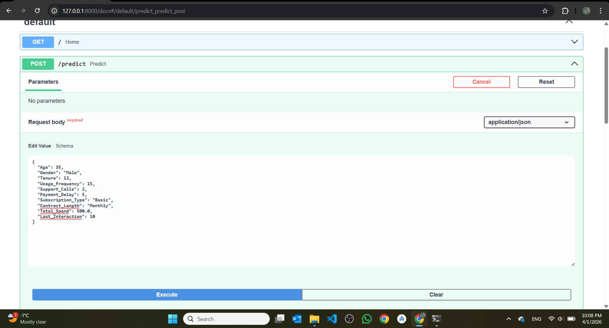
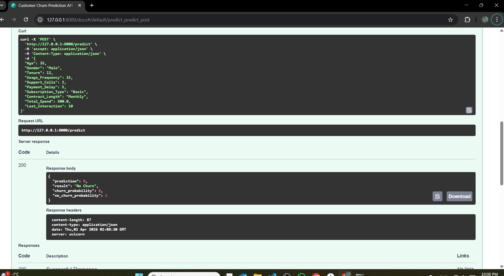
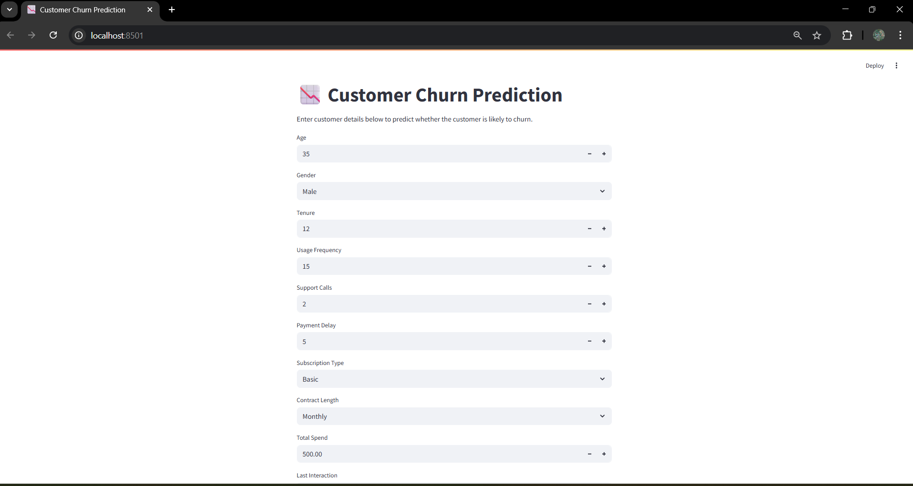
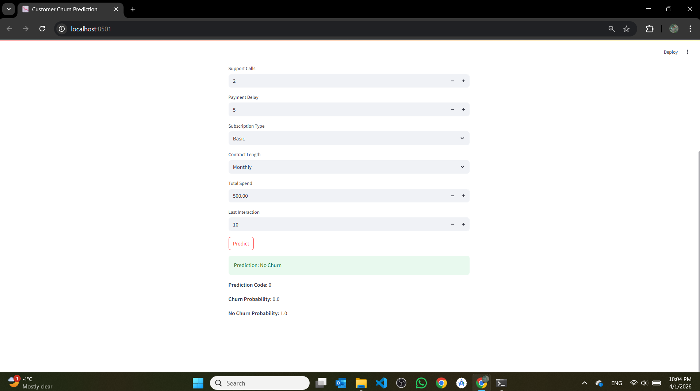

# 📉 Customer Churn ML Deployment

An end-to-end Machine Learning application that predicts customer churn using a Random Forest model. Fully deployed with a FastAPI backend and a Streamlit frontend.

---

## 🚀 Live Demo

- **Frontend App:** [Streamlit App](https://customer-churn-ml-deployment-krqepa7ohqdqubyfcdp9ks.streamlit.app)
- **API Docs:** [Swagger UI](https://customer-churn-api-njr0.onrender.com/docs)
- **API Base URL:** `https://customer-churn-api-njr0.onrender.com`

---

## 📌 Project Overview

Customer churn prediction is a critical task for businesses to retain customers. This project predicts whether a customer will churn based on behavioral and demographic features, using a trained Random Forest classifier served via a REST API.

---

## 🧠 Features Used

- Age, Gender, Tenure
- Usage Frequency, Support Calls, Payment Delay
- Subscription Type, Contract Length
- Total Spend, Last Interaction

---

## ⚙️ Tech Stack

- **Machine Learning:** scikit-learn (Random Forest)
- **Backend API:** FastAPI
- **Frontend UI:** Streamlit
- **Deployment:** Render (API) + Streamlit Cloud (Frontend)
- **Containerization:** Docker

---

## 📂 Project Structure

```
customer_churn_ml_deployment/
├── app/
│   ├── main.py             # FastAPI app and endpoints
│   ├── model_loader.py     # Model loading logic
│   └── schema.py           # Pydantic request/response schemas
├── frontend/
│   └── streamlit_app.py    # Streamlit UI
├── model/
│   ├── train_model.py      # Model training script
│   ├── churn_model.pkl     # Trained Random Forest model
│   └── encoders.pkl        # Label encoders
├── data/
│   └── customer_churn.csv  # Dataset
├── assets/                 # Screenshots
├── Dockerfile
├── requirements.txt
└── README.md
```

---

## 🔄 How It Works

1. User enters customer data in the Streamlit app
2. Streamlit sends a POST request to the FastAPI backend
3. API loads the trained Random Forest model
4. Model predicts churn probability
5. Result is returned and displayed to the user

---

## 📸 Screenshots

### API (Swagger UI)


### API Prediction Result


### Streamlit Interface


### Streamlit Prediction


---

## 🎯 Key Highlights

- End-to-end ML pipeline from training to deployment
- Real-time prediction via REST API
- Fully deployed and publicly accessible
- Clean separation between frontend and backend
- Dockerized for easy local development

---

## 📝 Notes

This project was developed as a personal portfolio project demonstrating ML deployment skills.

## 👤 Author

**Ahmad Issa**  
Master's in Computer Science — Data Science / Machine Learning / Applied AI  
Bishop's University

---

**Ahmad Issa**  
Master's Student in Computer Science  
Bishop's University  
Student ID: 002230777
